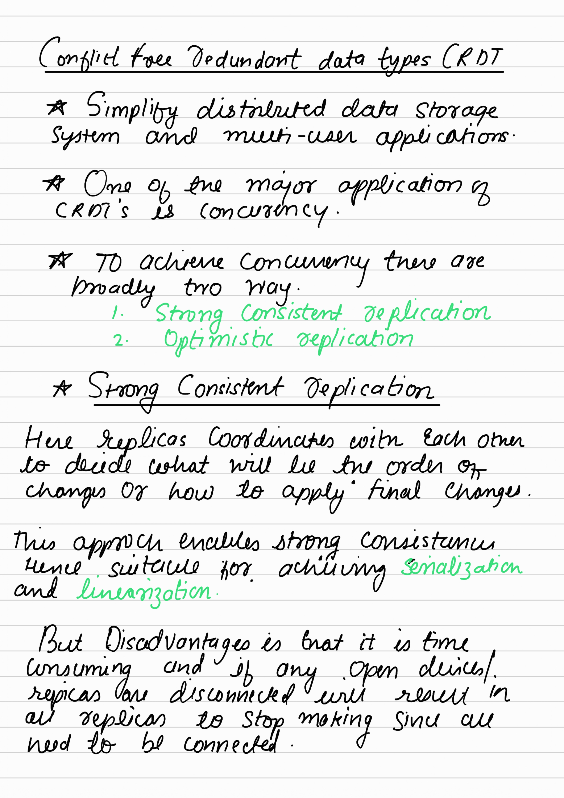
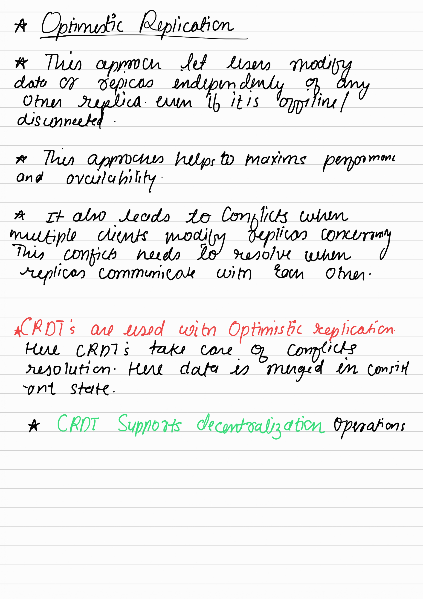

# Hello, I'm Abhishek Zade! 👋

## INFINITE BLACKBOARD PROJECT

The goal of the **Infinite Blackboard** project is to delve into the realm of canvas graphics and comprehend the mathematical foundations underlying the creation of an infinite drawing space.

### Visit the Project Website
[](https://zadeabhishek.github.io/infiboard/)

## 🚀 About Me
I'm an aspiring technologist with a passion for software development. I participated in Google Summer of Code 2021 and have nurtured skills in web development and machine learning. My journey also includes contributing to diverse projects, such as crafting MQTT servers using Flutter.

## 🛠 Skills
I'm proficient in a spectrum of technologies and languages:

- C++
- JavaScript
- Python
- Django
- Machine Learning
- Git
- SQL
- Data Structures & Algorithms
- React.js

## 🔗 Connect with Me
Feel free to connect with me on LinkedIn to explore my experiences and projects:
[](https://www.linkedin.com/in/arzade/)

## Running the Project Locally

### Run Manually

To run the **Infinite Blackboard** project on your local machine, follow these steps:

- Clone the project repository.
- Navigate to the project directory in your terminal:
   ```bash
   cd INFINITE-BOARD
   ```
- Install all Dependancy
   ```bash
    npm install
   ```
- Start Server
   ```bash
   npm start
   ```

### Run using Docker-Compose

- Initial command to build Docker Container
```bash
docker-compose up -d --build
```

- To Run Docker
```bash
docker-compose up
```

- Stop Docker
```bash
docker-compose stop
```

# CRDT theory


